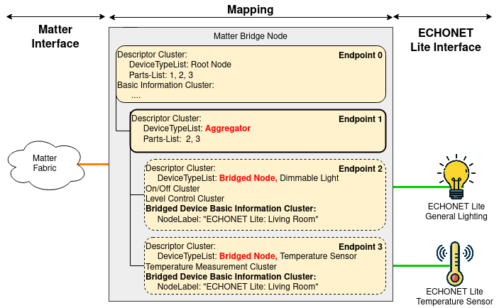

  

  

  

# Introduction

  

  

This is a bridge-app that convert **ECHONET Lite devices** into **Matter endpoint**. The bridge-app is extended from the project `example/bridge-app/linux`.

- This bridge-app manages (node detection, data extraction) ECHONET Lite devices and translate them into matter endpoints. The overall concept is in the picture



  

- Screen cast: To be added

- Demonstration video: To be uploaded

- Paper related to the bridge: Accepted, Presented, To be published to the IEEE Explore
- For Q&A : cupham@jaist.ac.jp (Japanese is OK) or nmtoan91@jaist.ac.jp

  

# Build and Run

  

  

1. Active Matter environment: [the build guide](guides/BUILDING.md)

  

2. Run the following commands

  

```

  

cd examples/bridge-app/echonet-lite-bridge-linux

  

make

  

```

  

## Parameters

  

  

| **Parameter** | **Description** |

  

| -asyncread | Asynchronous read |

  

| -asyncwrite | Asynchronous write |

  

| -get_interval <t> | Set get interval time <t>; Disable by setting <t> =0 |

  

  

  

# Runtime commands

  

  

| **Command** | **Description** |

  

  

| R | Factory reset |

  

| E | Safe Exit|

  

| e | Show all matter endpoints (mapped from ECHONET Lite devices)|

  

| f | Show all matter endpoints (mapped from ECHONET Lite devices, with gettable, settable properties)|

  

| g | Show all ECHONET Lite devices|

  

  

# Supported (ECHONET Lite) Devices

  

  

- 0x0290 : General Lighting Class

  

- 0x0291 : Mono Functional Lighting Class

  

- 0x0011: Temperature Sensor

  

- 0x000D: Illuminance Sensor

  

- 0x001B: CO2 Sensor

  

- 0x0003: Emergency button

  

- 0x0007: Human detection sensor

  

- 0x0012: Humidity sensor

  

- 0x0025: Water flow rate sensor

  

- 0x0022: Flame sensor

  

- 0x0262: Electrically operated curtain

  

- 0x0265: Electrically operated window

  

- 0x0130: Home air conditioner

  

- 0x05fd: JEM-A Switch

  

  

# How to support new (ECHONET Lite) Devices

  

  

1. Update file `Utils.cpp` by adding more matching rules (add more `case:` statement

  

```cpp

  

switch (echoClassCode)

  

{

  

case  0x0290: //return a light

  

case  0x0130: //return an airconditioner

  

// add more case to return your device type

  

```

  

2. Update file `EchonetEndpoint.cpp` to initialize Matter **endpoint** and add supported **cluster** (function: ``void EchonetEndpoint::CreateMatterDeviceEndpointOBJ()``)

  

  

```cpp

  

void  EchonetEndpoint::CreateMatterDeviceEndpointOBJ()

  

{

  

AttributePropertyAdapter* apt;

  

this->device = NULL;

  

switch (this->type)

  

{

  

case  CustomEndpointTypeEnum::ONOFF_LIGHT:

  

//Add required cluster of the endpoint

  

break;

  

case yourEndpointype:

  

// Add required cluster of the endpoint

  

```

  

3. Add declaration of supported **Clusters**, **Attribute**, **Commands** of each endpoint type following the example in file ```EchonetEndpointDefines.h```

  

Here is an example of the *Bridged Device Basic Attribute Cluster*:

  

```cpp

  

DECLARE_DYNAMIC_ATTRIBUTE_LIST_BEGIN(bridgedDeviceBasicAttrs_)

  

DECLARE_DYNAMIC_ATTRIBUTE(BridgedDeviceBasicInformation::Attributes::NodeLabel::Id, CHAR_STRING, kNodeLabelSize_, 0), /* NodeLabel */

  

DECLARE_DYNAMIC_ATTRIBUTE(BridgedDeviceBasicInformation::Attributes::Reachable::Id, BOOLEAN, 1, 0), /* Reachable */

  

DECLARE_DYNAMIC_ATTRIBUTE(BridgedDeviceBasicInformation::Attributes::FeatureMap::Id, BITMAP32, 4, 0), /* feature map */

  

DECLARE_DYNAMIC_ATTRIBUTE(BridgedDeviceBasicInformation::Attributes::VendorName::Id, CHAR_STRING, kNodeLabelSize_, 0), //0x8A

  

DECLARE_DYNAMIC_ATTRIBUTE(BridgedDeviceBasicInformation::Attributes::VendorID::Id, INT32U, 4, 0), //0x8A

  

DECLARE_DYNAMIC_ATTRIBUTE(BridgedDeviceBasicInformation::Attributes::ProductName::Id, CHAR_STRING, kNodeLabelSize_, 0), //0x8C

  

DECLARE_DYNAMIC_ATTRIBUTE(BridgedDeviceBasicInformation::Attributes::SoftwareVersion::Id, INT32U, 4, 0), // 0x82

  

DECLARE_DYNAMIC_ATTRIBUTE(BridgedDeviceBasicInformation::Attributes::SoftwareVersionString::Id, CHAR_STRING, kNodeLabelSize_, 0), //0x82

  

DECLARE_DYNAMIC_ATTRIBUTE(BridgedDeviceBasicInformation::Attributes::ManufacturingDate::Id, CHAR_STRING, kNodeLabelSize_, 0), //0x8E

  

DECLARE_DYNAMIC_ATTRIBUTE(BridgedDeviceBasicInformation::Attributes::PartNumber::Id, INT8U, 1, 0), // 0x8D

  

DECLARE_DYNAMIC_ATTRIBUTE(BridgedDeviceBasicInformation::Attributes::SerialNumber::Id, INT8U, 1, 0), // 0x83

  

DECLARE_DYNAMIC_ATTRIBUTE_LIST_END();

  

```

  

4. Update ```.zap``` file to support your desired cluster. The current ```bridge-app.zap``` in ```example/bridge-app``` only supports several device types. You need to **modify** the content of ```bridge-app.zap``` by adding target *cluster*.

  

*Note*: The best way to modify the ```.zap``` file is to **copy** the content from ```example/all-clusters-app/all-clusters-common/all-clusters-app.zap```. This ```.zap``` file has all supported clusters of the current SDK.

  

  

## Tips to manually without the zap tool edit the zap files

  

  

- bridge-app.matter

  

1. Search for *endpoint 0* in the **source**  `.matter file`

``Note``: Sometime the desired information is listed near *endpoint 2* tag too

2. Search for *endpoint 1* in the **target**  `.matter` file.

3. Copy and Paste necessary *clusters*'s metadata inside the *endpoint 1* tag

  

- bridge-app.zap

1. Look up for your desired `Cluster` name ( E.g `Window Covering`) by using the keyword from the **source** file (`all-clusters-app.zap`). There should be **2** results but you must **COPY TWO OF THEM**

2. Put it under ``endpointTypes.clusters`` tag of the **target**  `.zap` file.

  
  

# Troubleshooting ( When sync local with upstream)

  

The Matter SDK is getting involves by multiple developers quite often. It is not guarantee that this source code will work with the latest version of the SDK. The following steps are necessary to fix conflicts with the latest SDK from upstream.

  

  

1. Copy and replace zap files in bridge-common project

  

  

2. In file `src/app/clusters/window-covering-server/window-covering-server.cpp`

  

- Add the following line on the top

  
```#ifndef EMBER_AF_WINDOW_COVERING_CLUSTER_SERVER_ENDPOINT_COUNT```

```#define EMBER_AF_WINDOW_COVERING_CLUSTER_SERVER_ENDPOINT_COUNT (0)```

```#endif```

  

- Modify `HasFeature()` function (**this is a bug from the SDK**!!!):

  

As the current ```HasFeature()``` does not return a valid value (when *endpoint id > 4*), the bridge can not support more than 4 endpoint. It does not matter, just return `TRUE`. For example:

  

```cpp
if (delegate)
{
    if (HasFeature(endpoint, Feature::kPositionAwareLift)|| true)
        {
            LogErrorOnFailure(delegate->HandleMovement(WindowCoveringType::Lift,100));
        }

    if (HasFeature(endpoint, Feature::kPositionAwareTilt)|| true)
        {
            LogErrorOnFailure(delegate->HandleMovement(WindowCoveringType::Tilt,100));
        }

}

```

  

Alway add ```HasFeature(...) || true``` to the ```if``` statement

  

3. In file ```src/app/clusters/window-covering-server/window-covering-delegate.h```

  

  

- Add `int openPercent variable` to specify open/close percentage (without it, we can not open or close anything): For example

  

```cpp
virtual CHIP_ERROR
HandleMovement(WindowCoveringType type, int openPercent) = 0;

```

  

Other `delegate` that calls this function also need to be updated such as:

  

```cpp
delegate->HandleMovement(WindowCoveringType::Lift,100)
delegate->HandleMovement(WindowCoveringType::Tilt,100)
delegate->HandleMovement(WindowCoveringType::Lift,0)
delegate->HandleMovement(WindowCoveringType::Tilt,0)
delegate->HandleMovement(WindowCoveringType::Lift,liftValue)
delegate->HandleMovement(WindowCoveringType::Lift,percent100ths)
delegate->HandleMovement(WindowCoveringType::Tilt,tiltValue)
delegate->HandleMovement(WindowCoveringType::Tilt,percent100ths)
```
